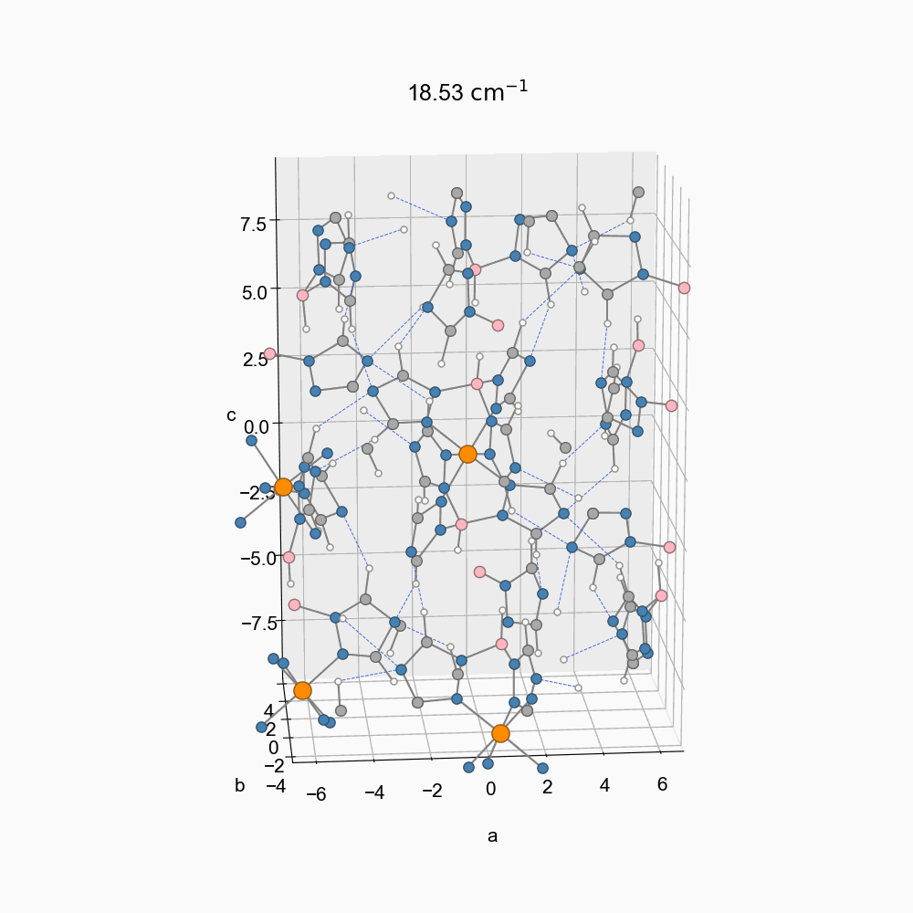

# 📊 SCO-thermal

Welcome!

This repository contains ready-to-use **Python scripts** for comprehensive analysis of multiple experimental datasets collected using diverse experimental techniques for the paper [*Reversible regulation of thermal conductivity through spin-crossover transitions*](https://qichensong.github.io/). With a single command, you can reproduce all key statistical analyses and generate high-quality, publication-ready figures.

## 🌟 Highlights
- Raw data to high-quality figures 
- Flexible, customizable plotting styles
- Analysis across diverse experimental techniques

<br>
<span style="margin-left:30px; font-size:smaller; color:gray;">
  Phonon eigenvectors in the low-spin phase
</span>


## 📂 File Structure
```
📂 sco-thermal/
    📄 requirements.txt
    📄 README.md
    📄 LICENSE
    📂 heat_capacity/
        🟢 **plot_Cp.py**   ← Executable script for heat capacity analysis
        📂 data/ ← Raw data
    📂 fdtr/
        🟢 **plot_kappa.py**   ← Executable script for thermal conductivity analysis from frequency-domain thermoreflectance (FDTR)
        📂 data/  ← Raw data
    📂 ins/
        📂 Sample/
            🟢 **load_sqw.py**   ← Executable script for inelastic neutron scattering (INS) analysis for the actual sample
            📄 Aqw_plotting.py
            📄 cal_scattering_phase_space.py
            📄 constants.py
            📄 functions.py
            📄 intQ.py
            📄 mpl_style.py ← Set up plotting style
            📄 plot_scatt_phase_space.py
            📄 plot_spectral_C.py
            📄 plotdos.py
            📄 sqw_plotting.py
            📂 data/  ← Raw data
        📂 Vanadium/
            🟢 **vanadium.py** ← Executable script for neutron scattering analysis for the reference sample
            📂 data/ ← Raw data
    📂 dftb_ph/
        🟢 **get_inter_vs_intra_from_hessian.py** ← Executable script for density functional tight-binding (DFTB) analysis: eigenvalues
        🟢 **get_eigenvectors.py** ← Executable script for density functional tight-binding (DFTB) analysis: phonon eigenvectors visualized in movies
        📂 data/ ← Raw data
```

## 🚀 Quickstart

1. **Clone this repository**
2. **Install dependencies**  
   ```bash
   pip install -r requirements.txt
3. **Run the executable Python script (marked by 🟢) in the folder for different measurements**

   For example, to run the analysis for neutron rcattering data, navigate to the `ins/Sample` folder 
    ```bash
   cd ins/Sample
   ```
   and execute 
   ```bash
   python load_sqw.py
   ```

## 📬 Contact

For questions and suggestions, please contact:

- **Qichen Song**  
qichensong42@gmail.com  

or open an issue on this repository.
   
